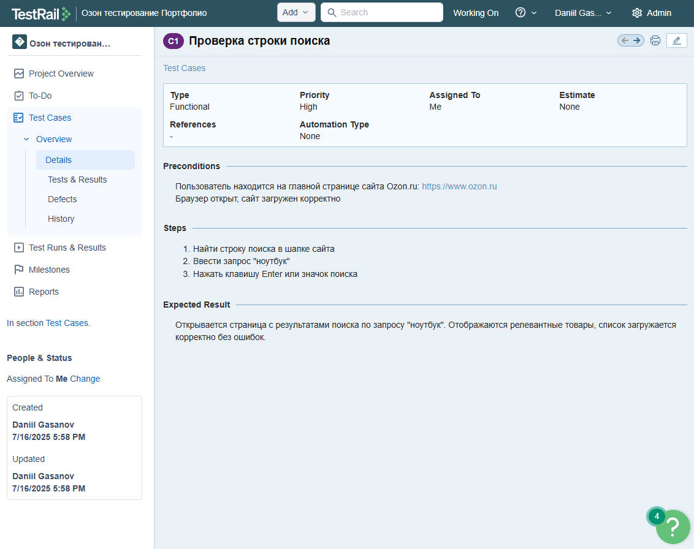
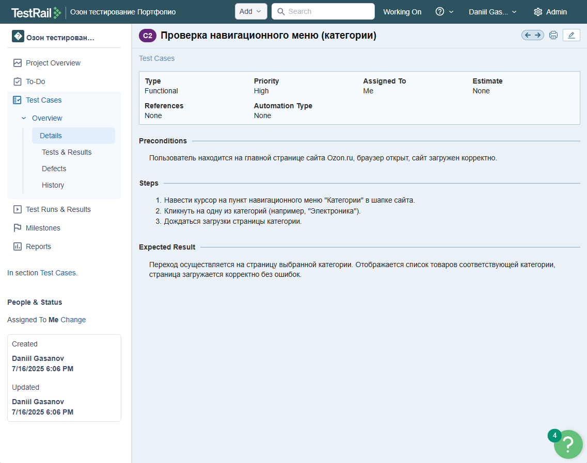
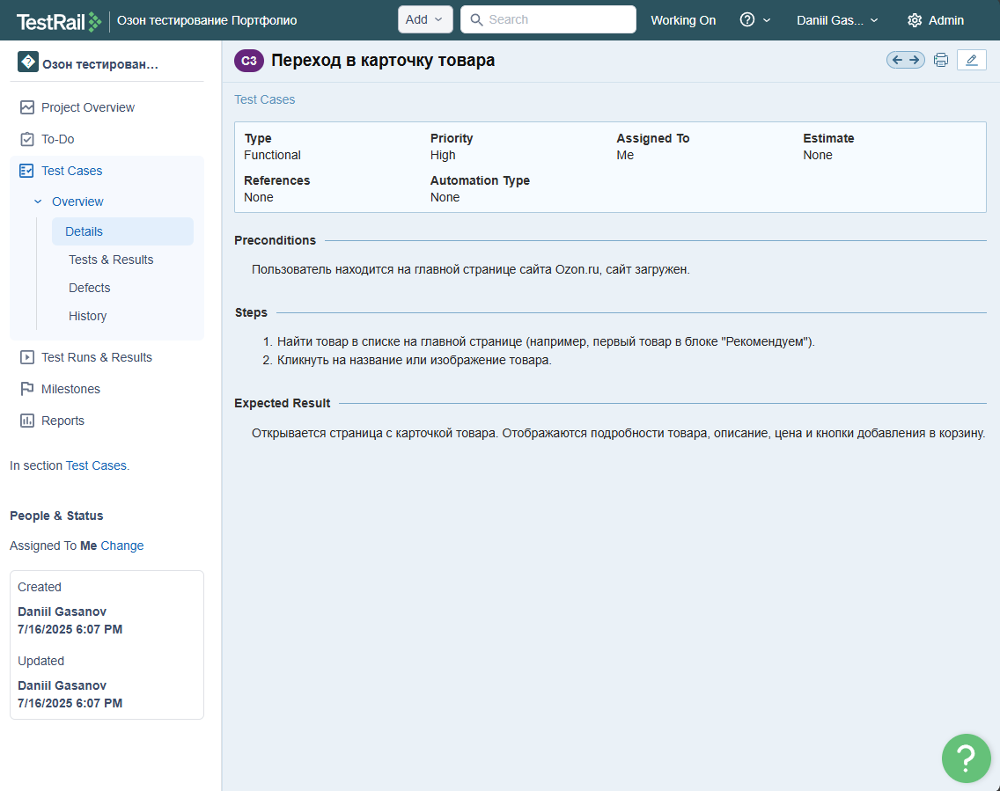
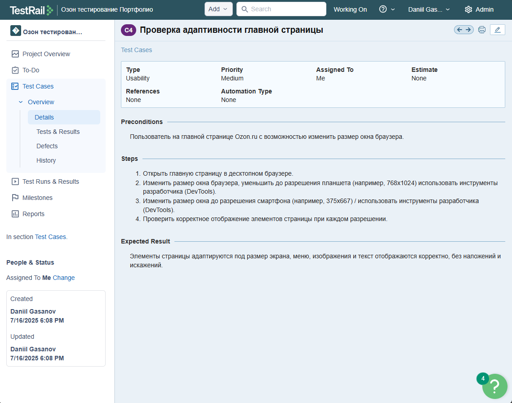
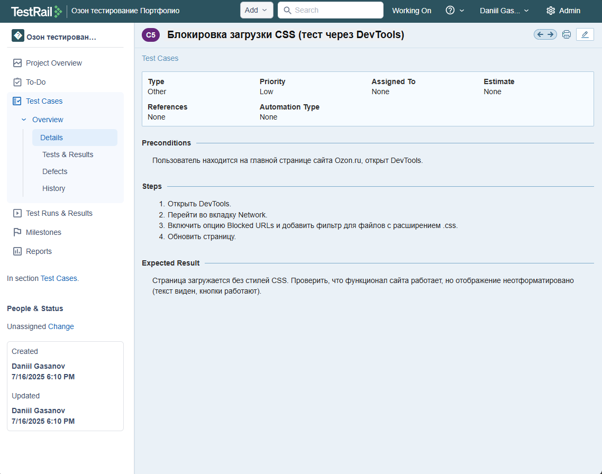
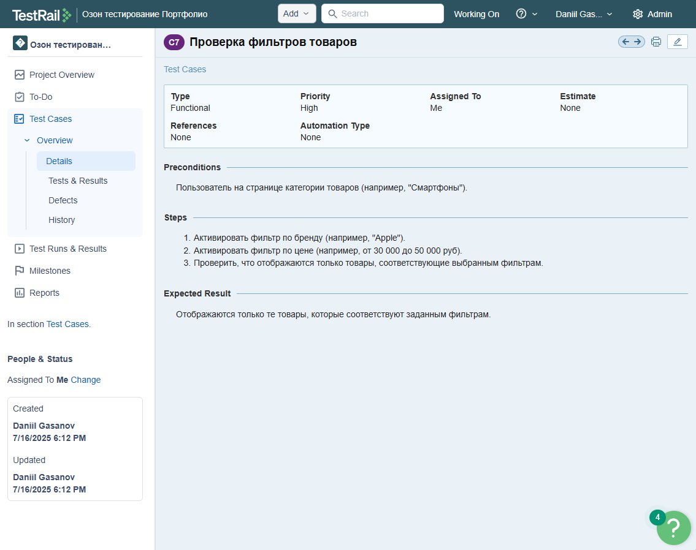
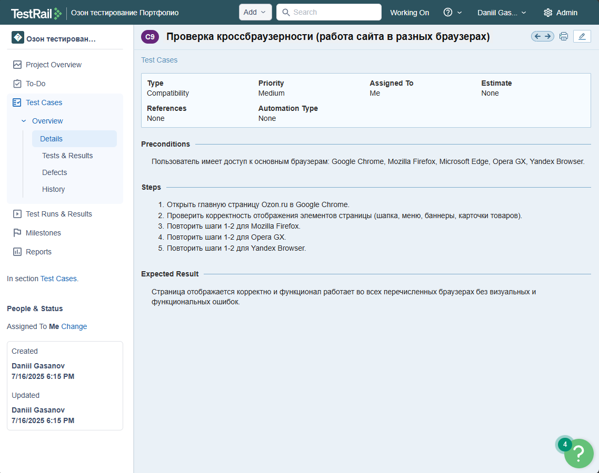
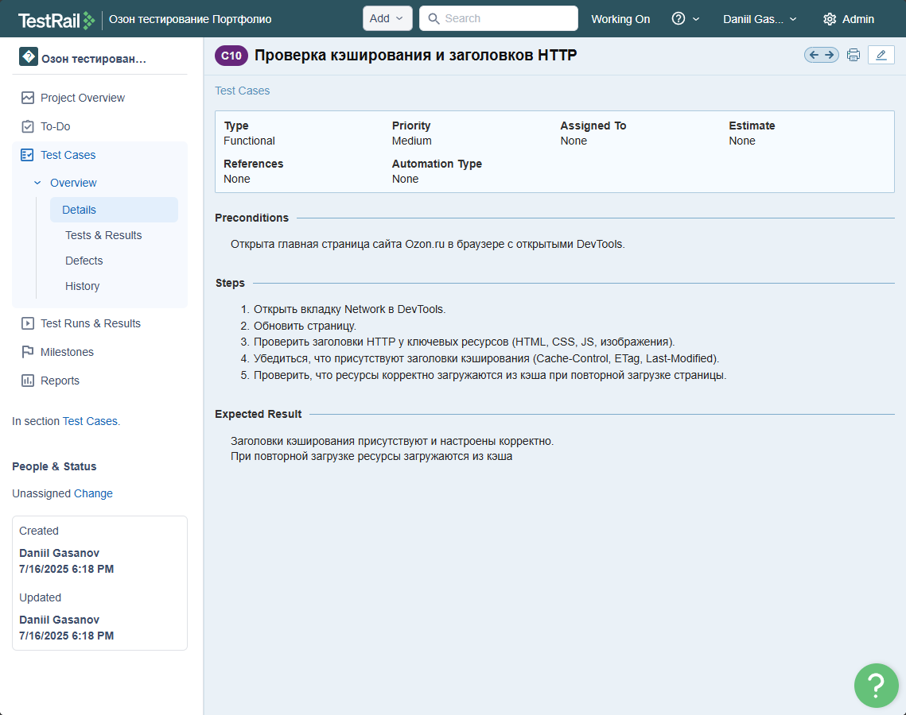

# Тест-кейсы: Главная страница Ozon.ru

Документация тест-кейсов оформлена в системе **TestRail**.  
Главная страница сайта [ozon.ru](https://ozon.ru)  

### 🔹 Тест-кейс №1 — Проверка строки поиска

### 🔹 Тест-кейс №2 — Проверка навигационного меню

### 🔹 Тест-кейс №3 — Переход в карточку товара

### 🔹 Тест-кейс №4 — Проверка адаптивности главной страницы

### 🔹 Тест-кейс №5 — Блокировка загрузки CSS

### 🔹 Тест-кейс №6 — Проверка сортировкеи товаров

### 🔹 Тест-кейс №7 — Проверка фильтров товаров

### 🔹 Тест-кейс №8 — Проверка перехода по ссылкам

### 🔹 Тест-кейс №9 — Проверка кроссбраузерности

### 🔹 Тест-кейс №10 — Проверка кэширования и заголовков HTTP

### 🔹 Тест-кейс №11 — Проверка производительности страницы

## 💬 Комментарии

- DevTools использовался для анализа производительности, блокировки ресурсов и имитации мобильных устройств.
- Тестирование кроссбраузерности проводилось вручную.

## Другие разделы тестирования

- [Корзина](https://github.com/daniilg17/testing-website/blob/main/basketQase.md) — тест-кейсы функционала корзины  
- [Регистрация и авторизация](https://github.com/daniilg17/testing-website/blob/main/authTestIt.md) — проверка регистрации, входа и восстановления доступа  
- [Оформление заказа](https://github.com/daniilg17/testing-website/blob/main/order.md) — тестирование оформления покупки и выбора способов доставки/оплаты  
- [Личный кабинет](https://github.com/daniilg17/testing-website/blob/main/profile.md) — тесты работы с аккаунтом пользователя и настройками