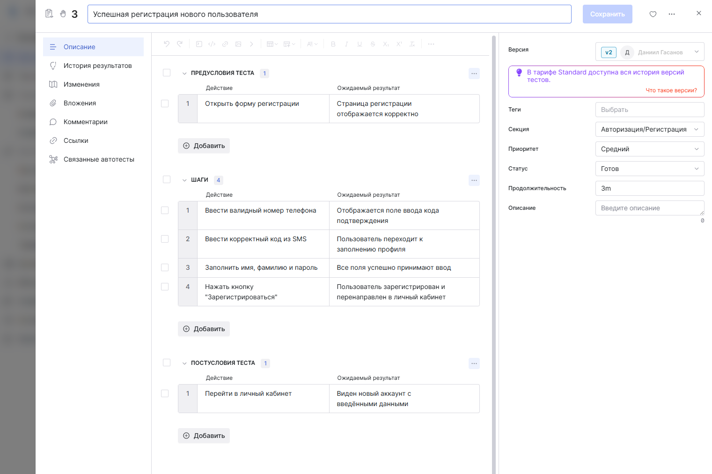
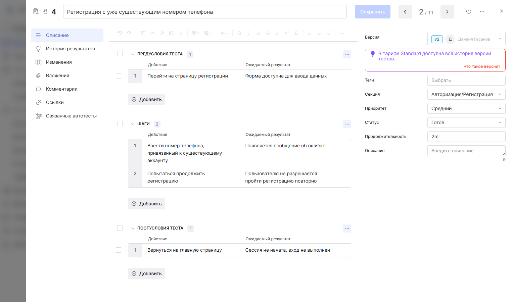
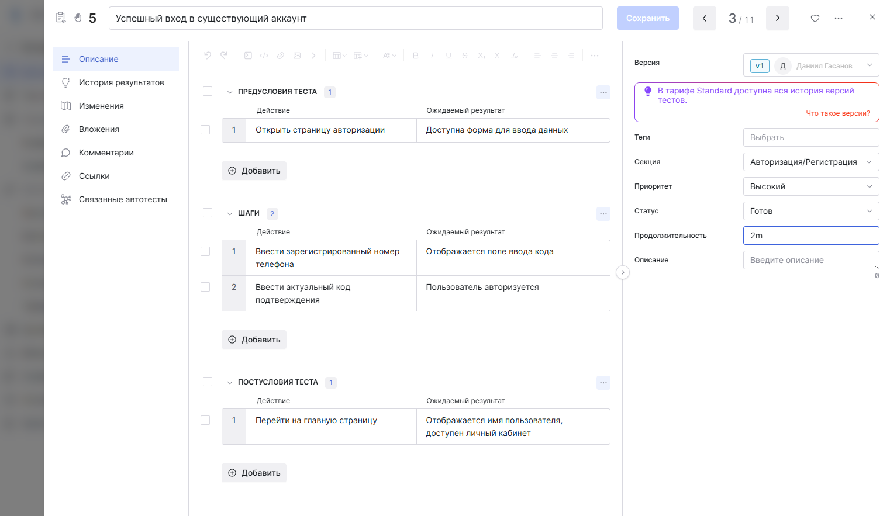
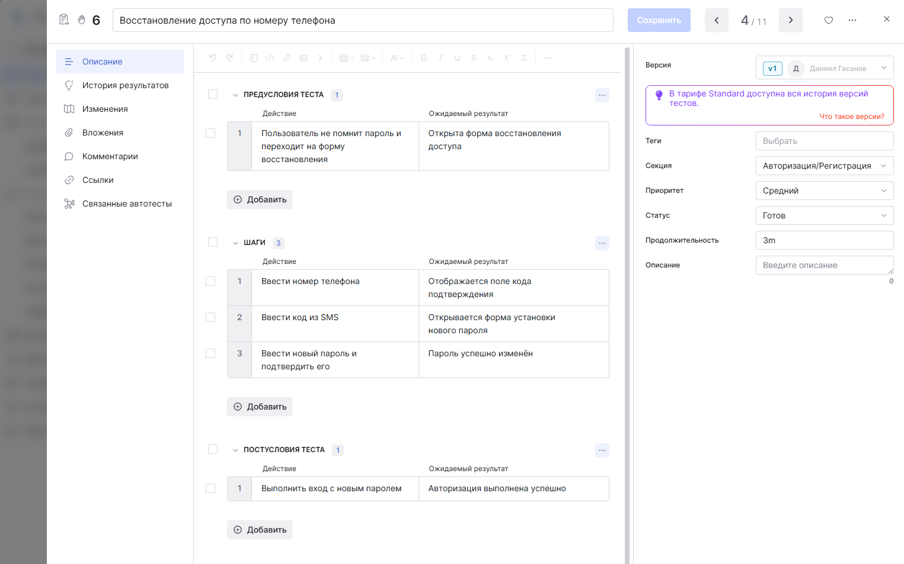
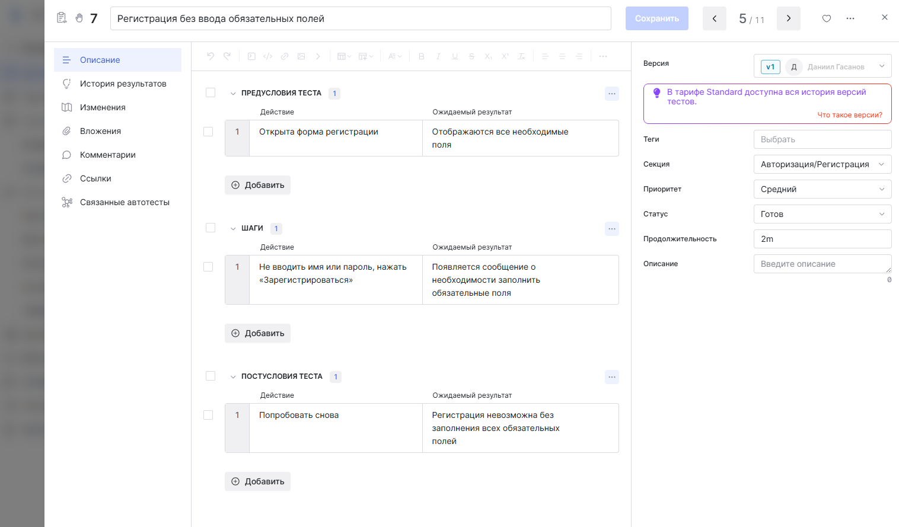
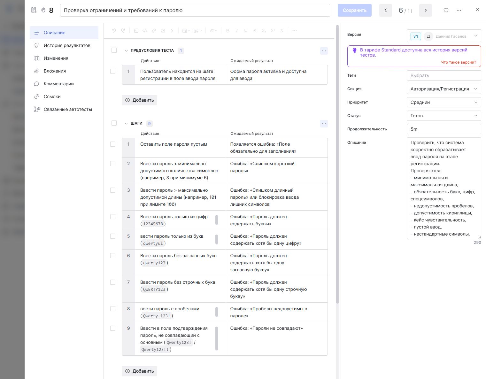
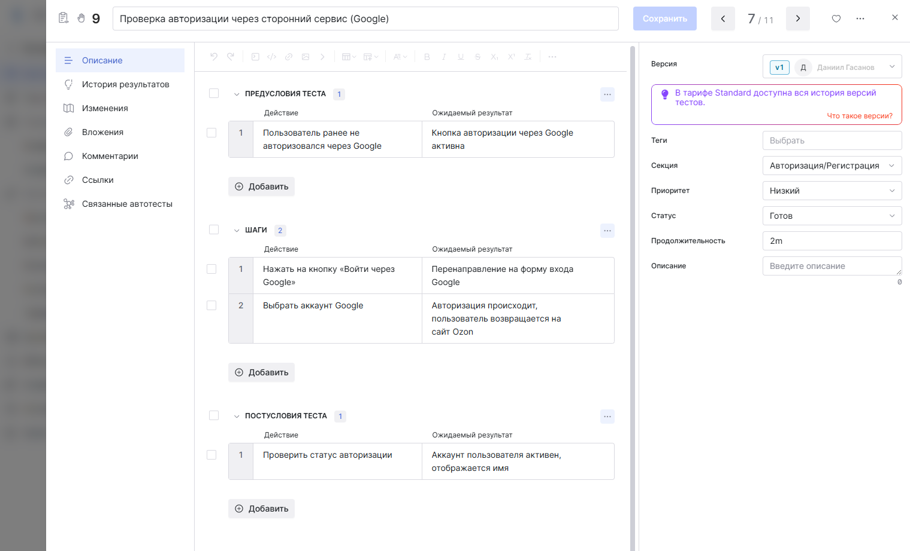
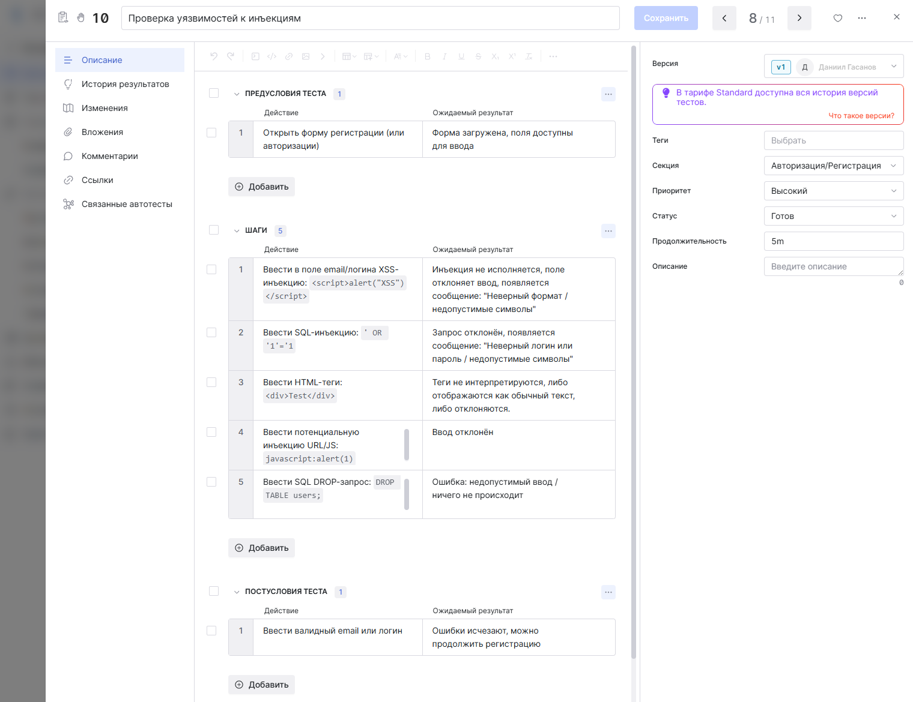
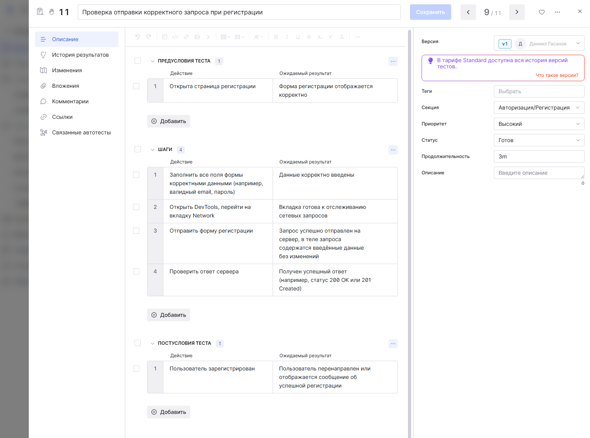
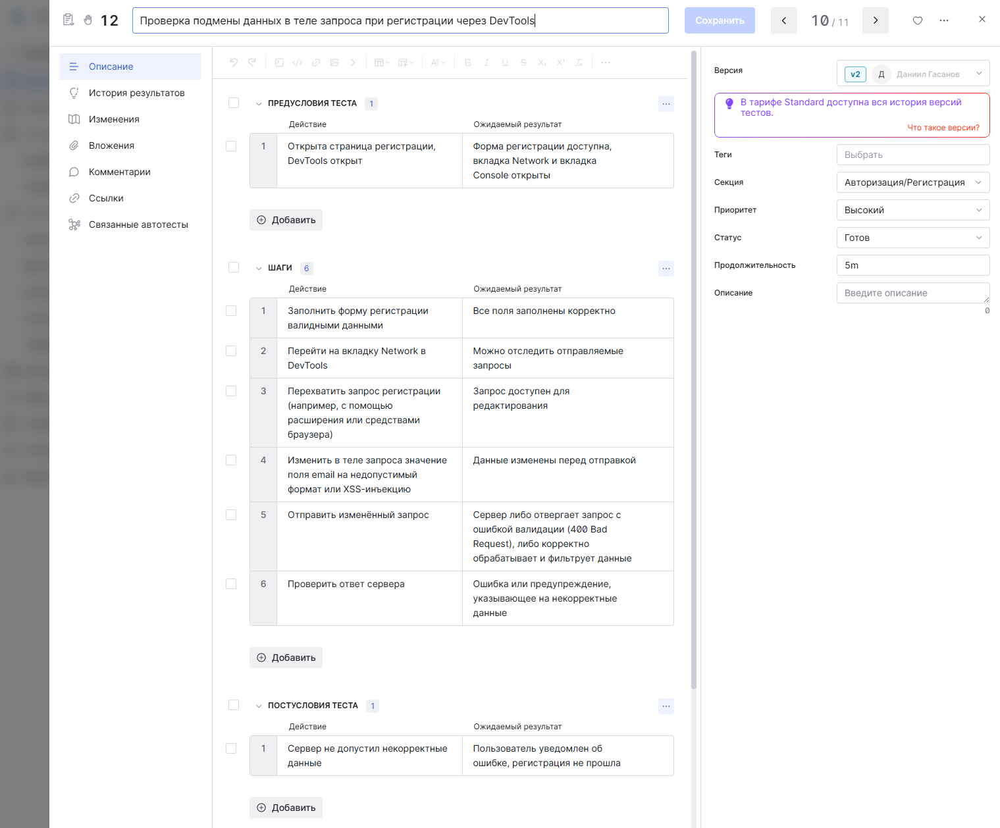

# Тест-кейсы: Регистрация и авторизация Ozon.ru

Документация тест-кейсов оформлена в системе **Test IT**.
Раздел регистрации и авторизации сайта [ozon.ru](https://www.ozon.ru)

### 🔹 Тест-кейс №1 — Успешная регистрация нового пользователя

### 🔹 Тест-кейс №2 — Регистрация с уже существующим номером телефона

### 🔹 Тест-кейс №3 — Успешный вход в существующий аккаунт

### 🔹 Тест-кейс №4 — Восстановление доступа по номеру телефона

### 🔹 Тест-кейс №5 — Регистрация без ввода обязательных полей

### 🔹 Тест-кейс №6 — Проверка ограничений и требований к паролю

### 🔹 Тест-кейс №7 — Проверка авторизации через сторонний сервис

### 🔹 Тест-кейс №8 — Проверка уязвимостей к инъекциям

### 🔹 Тест-кейс №9 — Проверка отправки корректного запроса при регистрации

### 🔹 Тест-кейс №10 — Проверка подмены данных в теле запроса при регистрации через DevTools

---

## 💬 Комментарии

* Для тестирования использовались стандартные формы регистрации и авторизации сайта Ozon.ru.
* Особое внимание уделялось безопасности и корректности обработки пользовательских данных.

## Другие разделы тестирования

- [Главная страница](https://github.com/daniilg17/testing-website/blob/main/MainPageTR.md) — тест-кейсы функционала главной страницы  
- [Корзина](https://github.com/daniilg17/testing-website/blob/main/basketQase.md) — тест-кейсы функционала корзины  
- [Оформление заказа](https://github.com/daniilg17/testing-website/blob/main/order.md) — тестирование оформления покупки и выбора способов доставки/оплаты  
- [Личный кабинет](https://github.com/daniilg17/testing-website/blob/main/profile.md) — тесты работы с аккаунтом пользователя и настройками
