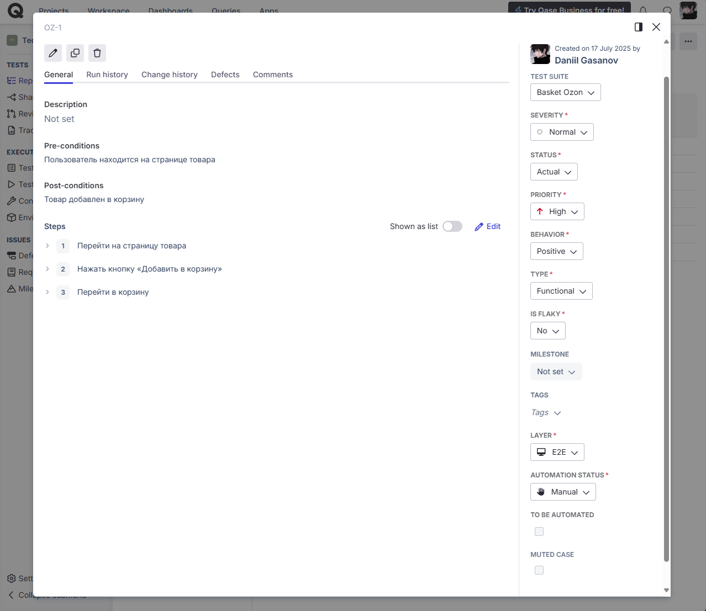
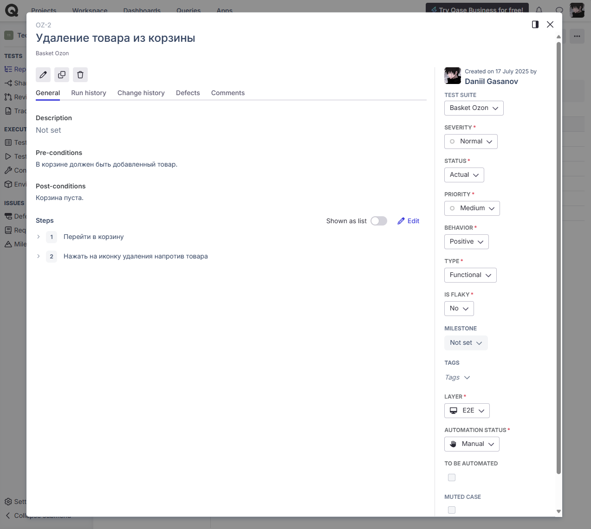
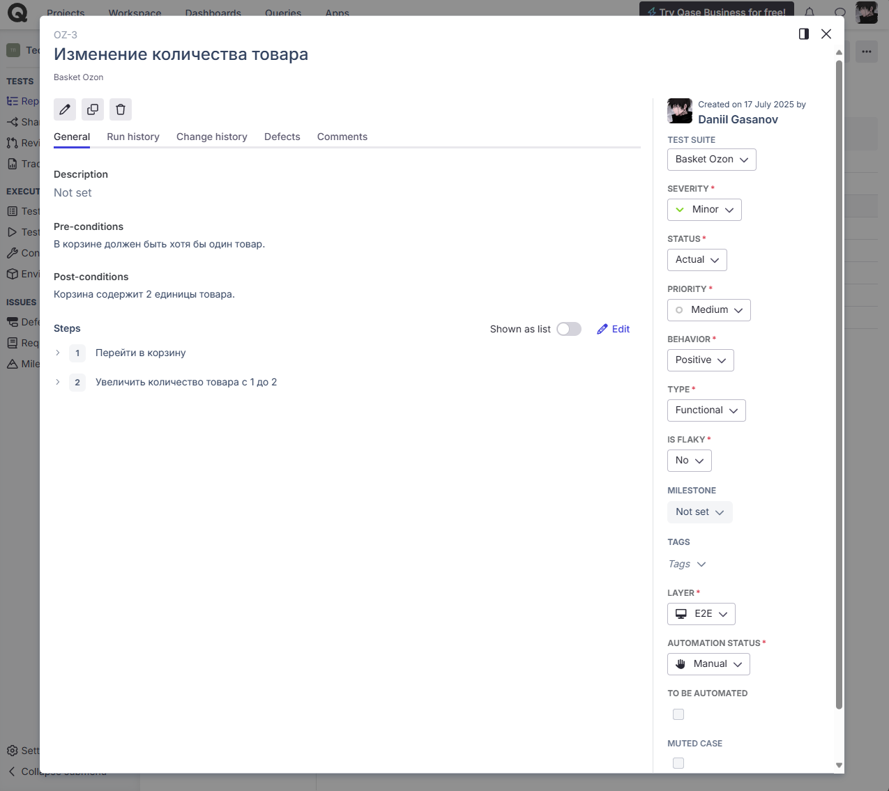
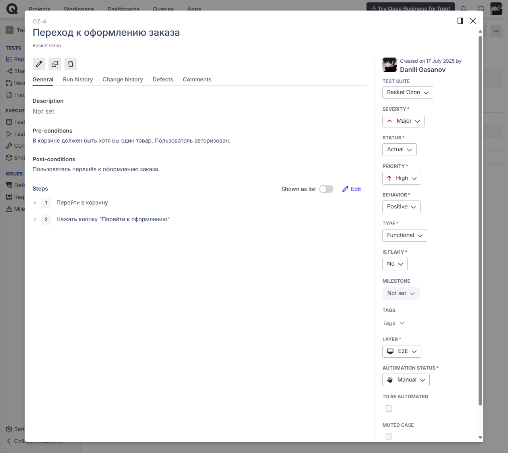
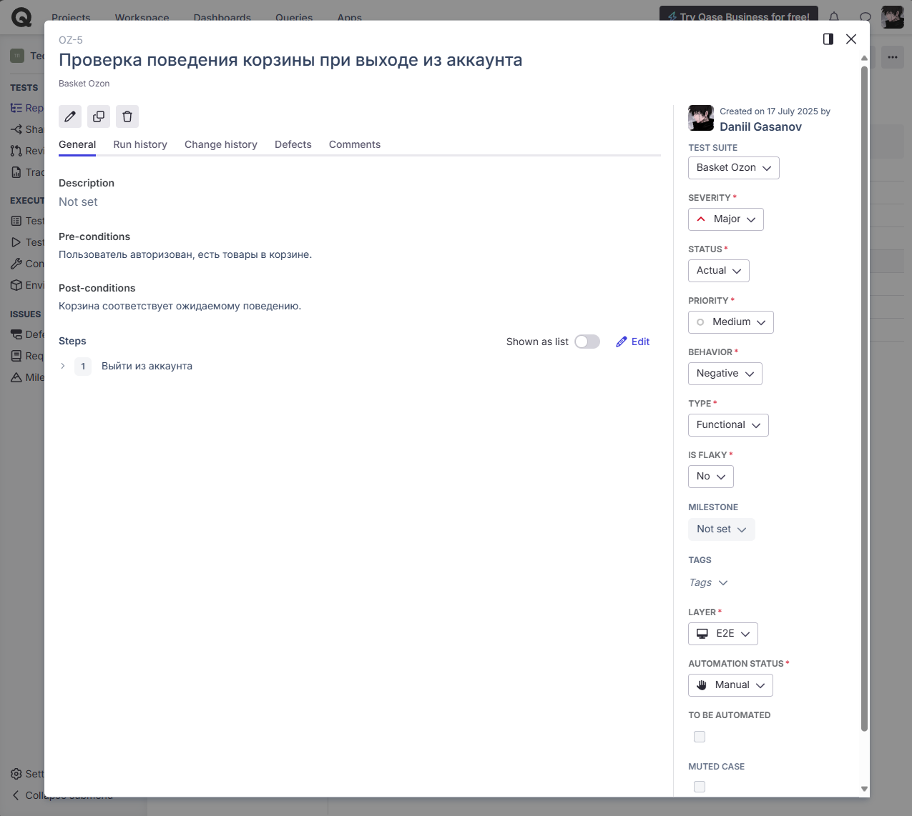
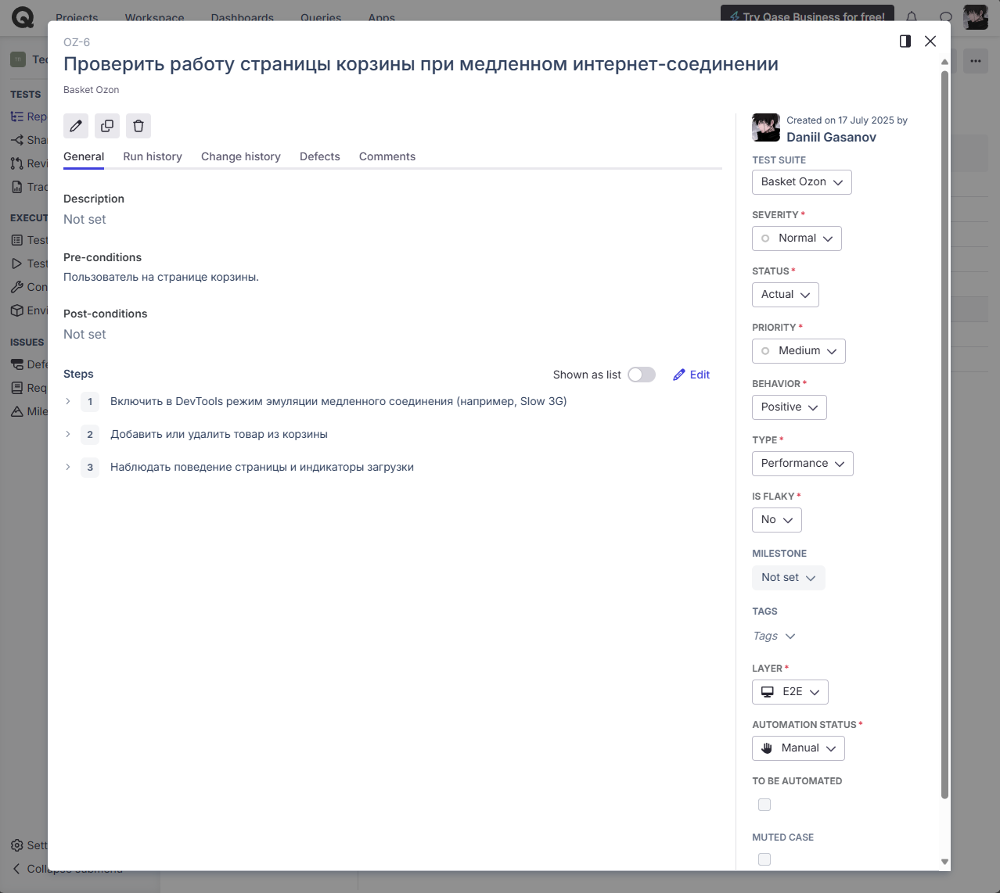
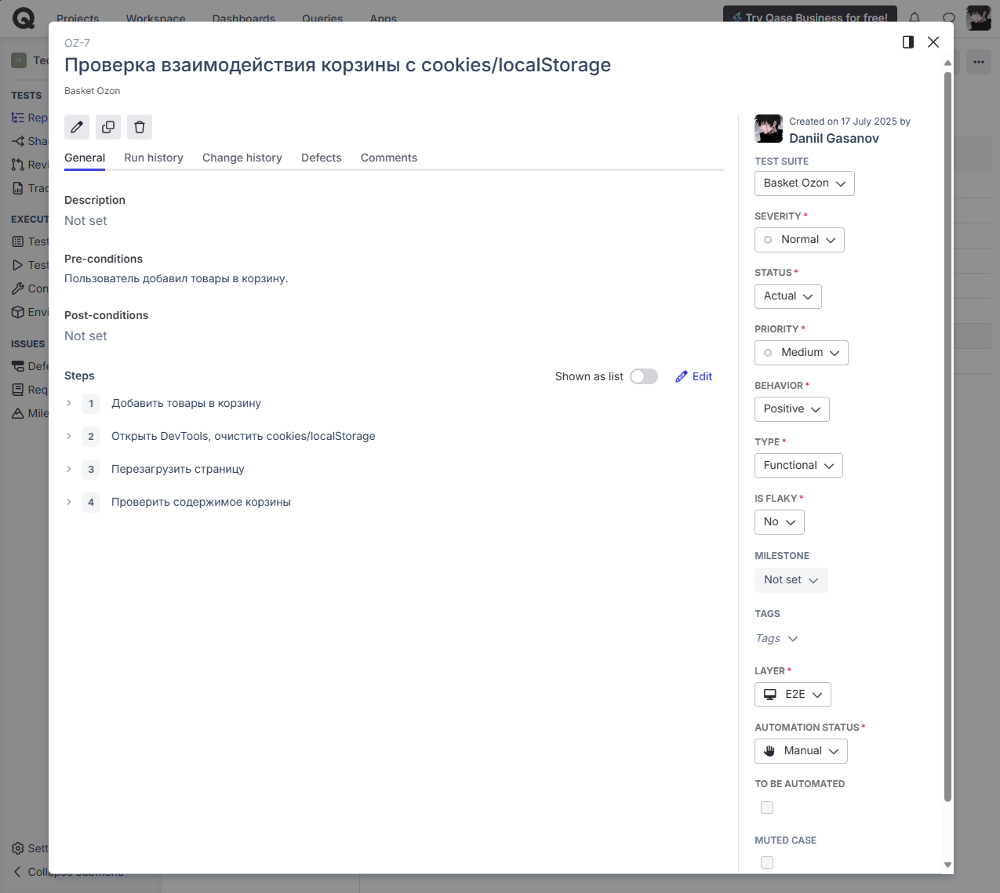
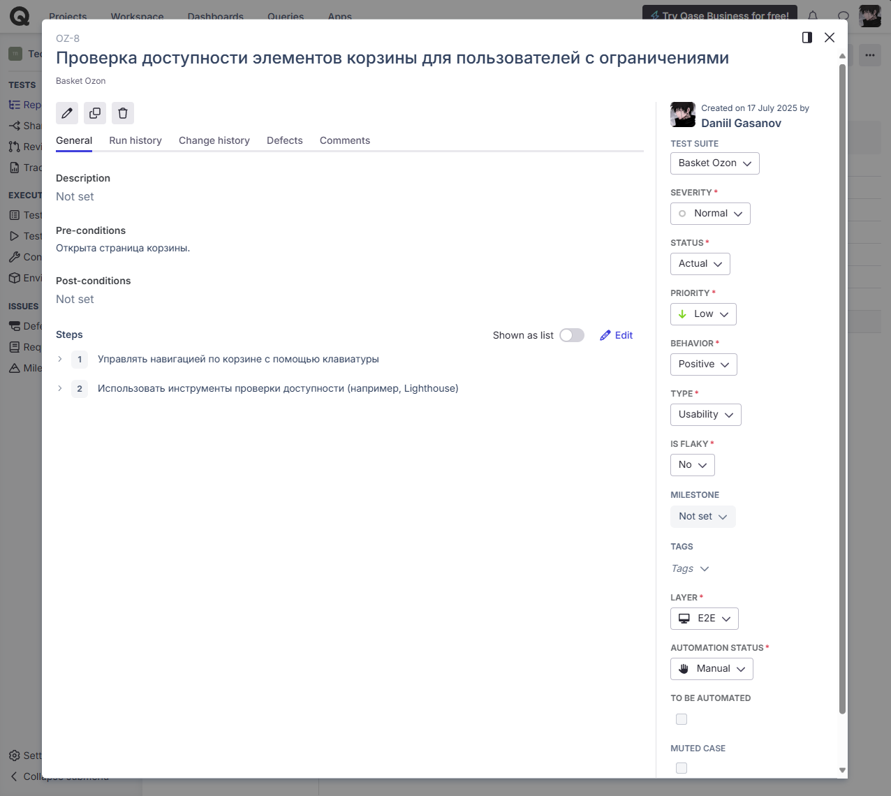

# Тест-кейсы: Корзина Ozon.ru

Документация тест-кейсов оформлена в системе **Qase.io**.  
Страница корзины сайта [ozon.ru](https://www.ozon.ru/cart)  

---

### 🔹 Тест-кейс №1 — Добавление товара в корзину  

### 🔹 Тест-кейс №2 — Удаление товара из корзины  

### 🔹 Тест-кейс №3 — Изменение количества товара  

### 🔹 Тест-кейс №4 — Переход к оформлению

### 🔹 Тест-кейс №5 — Проверка поведения корзины при выходе из аккаунта

### 🔹 Тест-кейс №6 — Проверить работу страницы корзины при медленном интернет-соединении

### 🔹 Тест-кейс №7 — ППроверка взаимодействия страницы с cookies/localStorage

### 🔹 Тест-кейс №8 — Проверка доступности элементов корзины для пользователей с ограничениями

## 💬 Комментарии

- Для некоторых тестов использовался DevTools для эмуляции медленной сети, блокировки ресурсов и анализа сохранения данных.  
- Тестирование доступности включало навигацию с клавиатуры и проверку инструментами Lighthouse.

## Другие разделы тестирования

- [Главная страница](https://github.com/daniilg17/testing-website/blob/main/MainPageTR.md) — тест-кейсы функционала главной страницы  
- [Регистрация и авторизация](https://github.com/daniilg17/testing-website/blob/main/authTestIt.md) — проверка регистрации, входа и восстановления доступа  
- [Оформление заказа](https://github.com/daniilg17/testing-website/blob/main/orderQatouch.md) — тестирование оформления покупки и выбора способов доставки/оплаты  
- [Личный кабинет](https://github.com/daniilg17/testing-website/blob/main/profileTestiny.md) — тесты работы с аккаунтом пользователя и настройками
- [Список багов](https://github.com/daniilg17/testing-website/blob/main/bugs.md) — баг-репорты, оформленные в Jira, YouTrack и Redmine  

---

🔙 [Вернуться назад к описанию проекта](https://github.com/daniilg17/testing-website/blob/main/README.md)