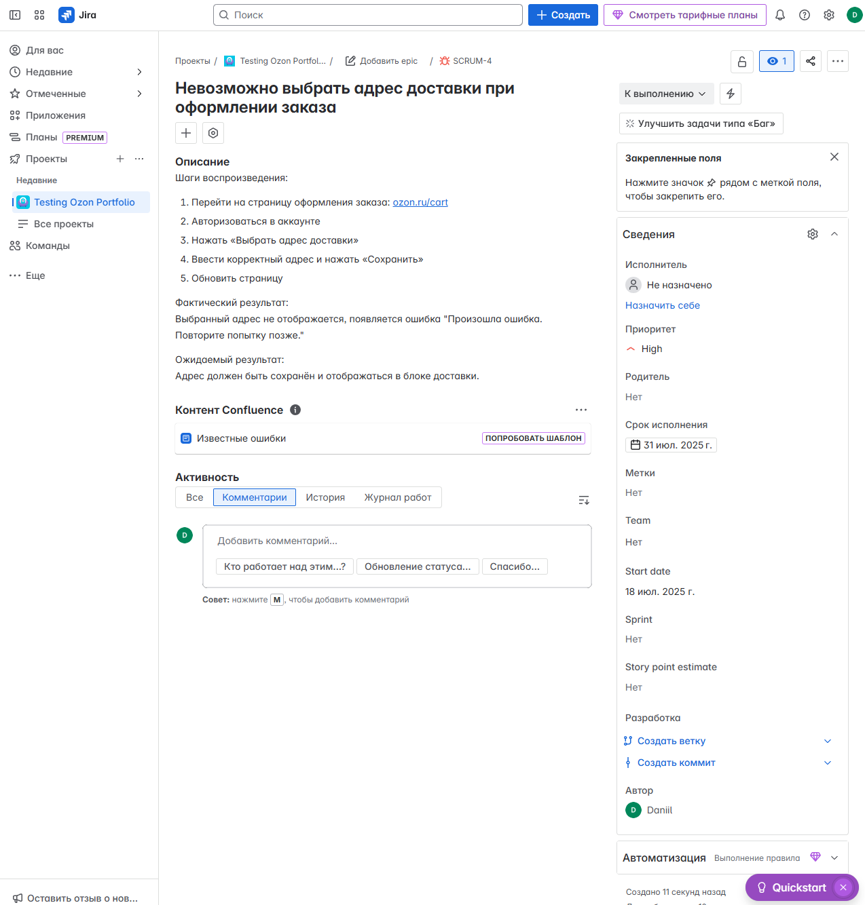
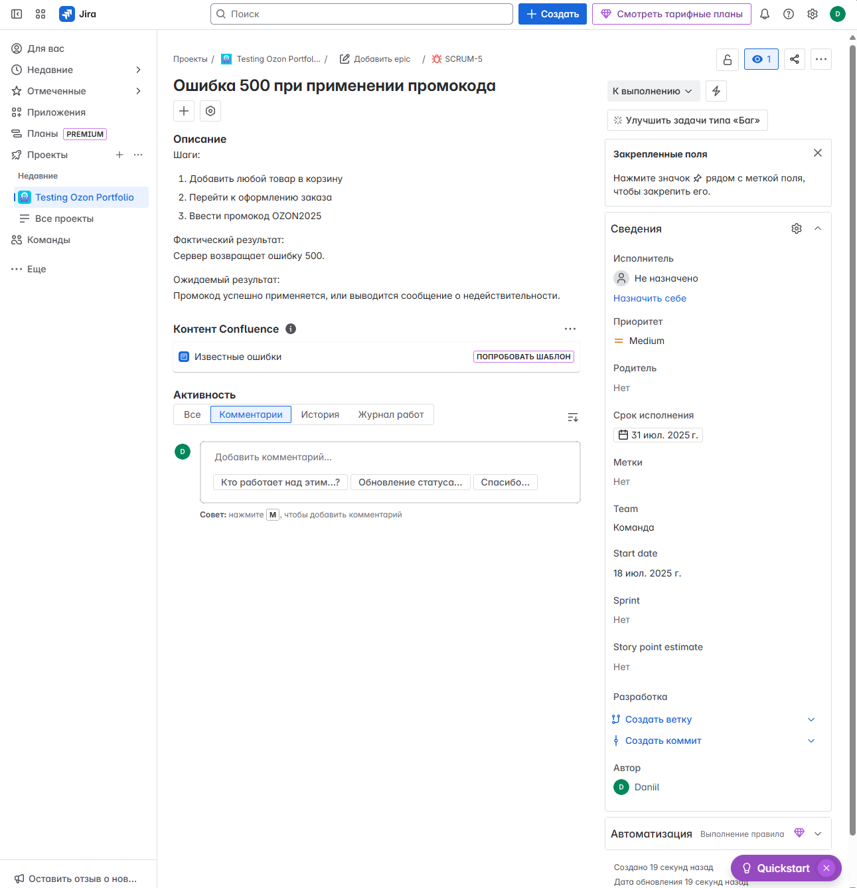
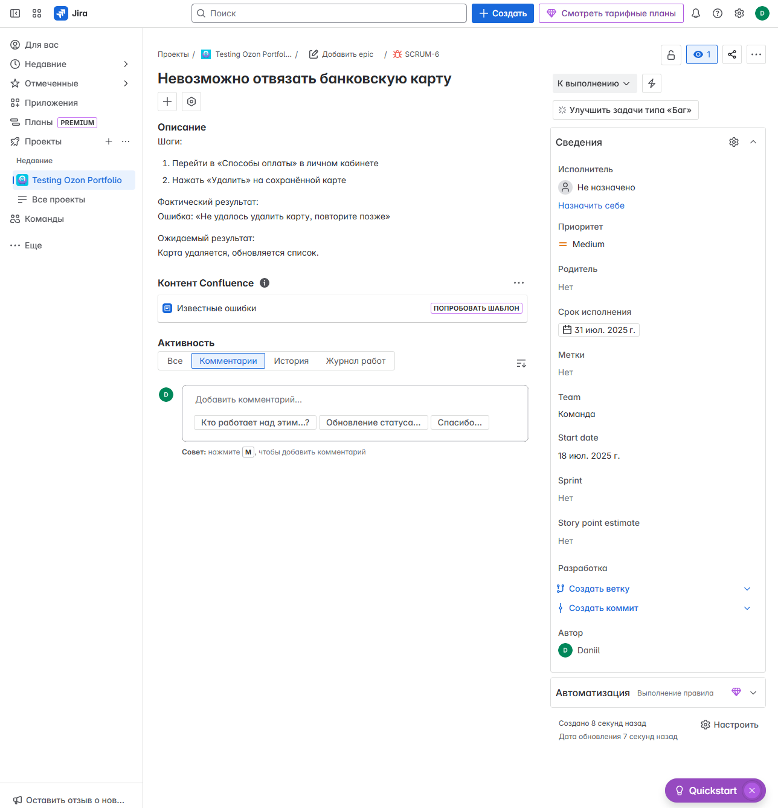
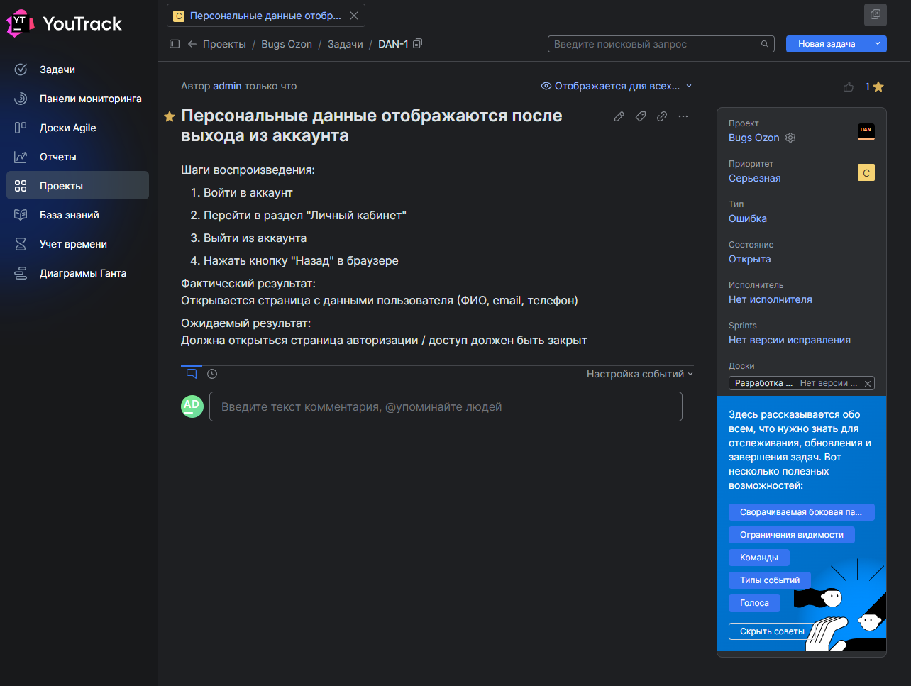
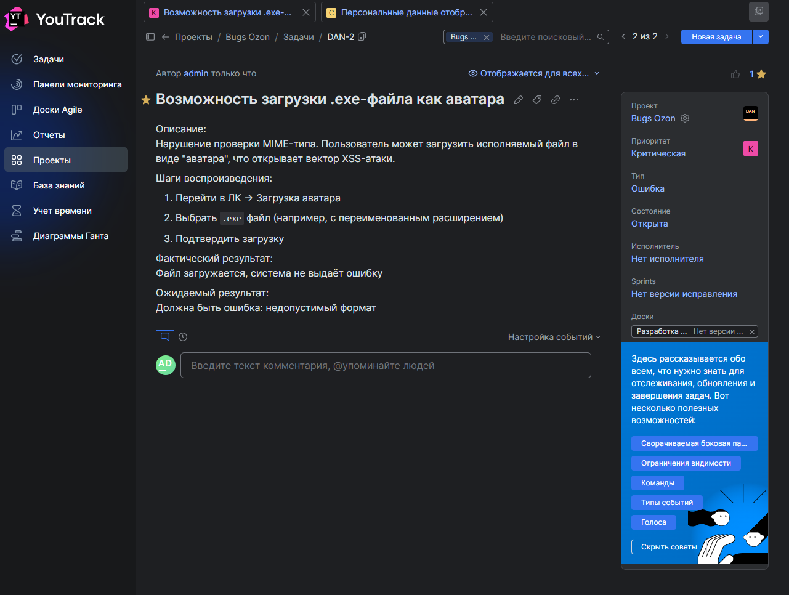
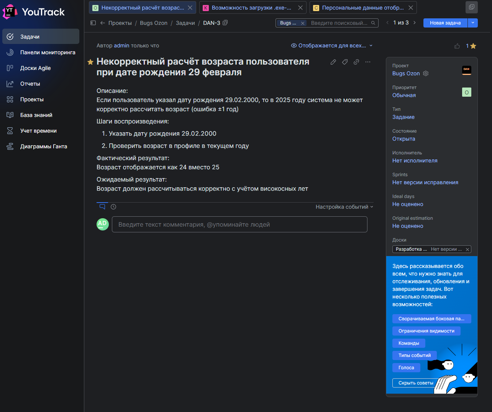
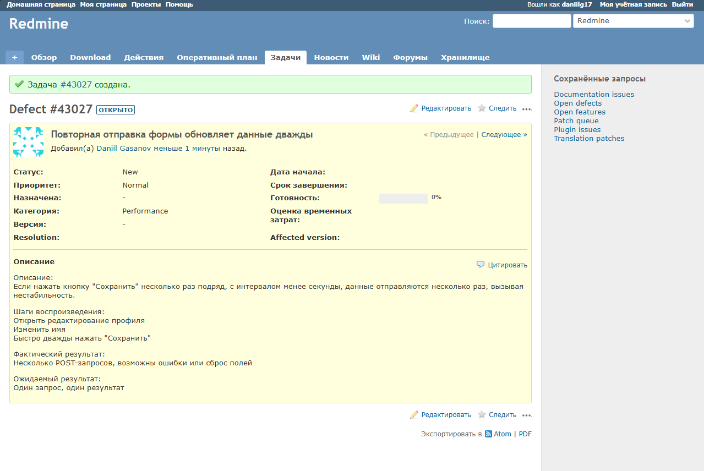
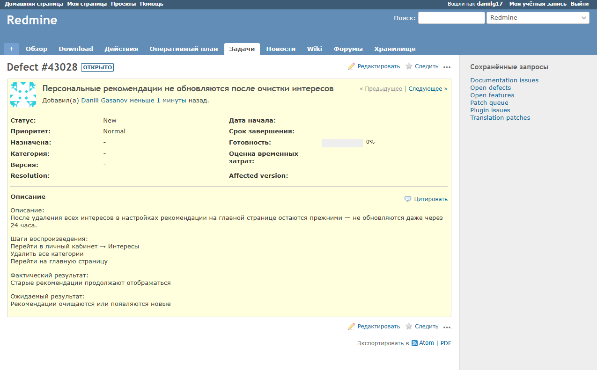
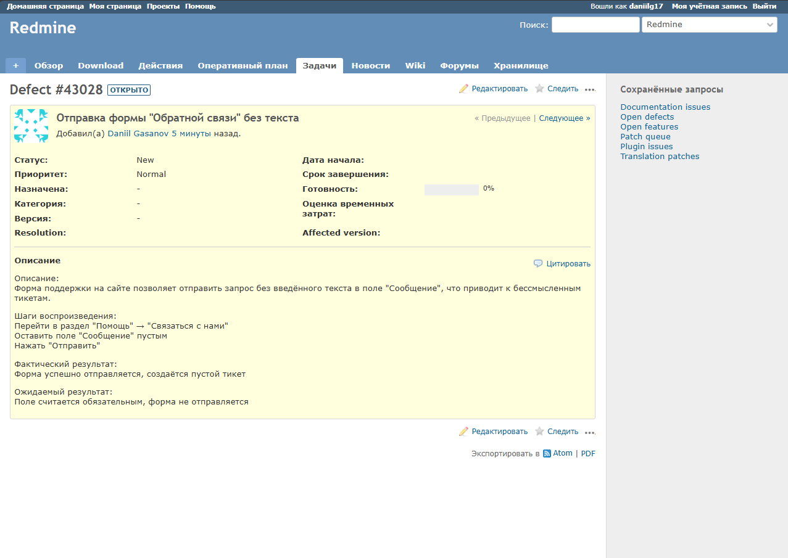

# 🐞 Список баг-репортов Ozon.ru

Данный документ содержит список дефектов, оформленных в трёх различных системах управления задачами: Jira, YouTrack и Redmine.  
Баги сгруппированы по категориям в зависимости от используемого инструмента.

## 🔷 Jira

### Баг #1 — Невозможно выбрать адрес доставки при оформлении заказа

### Баг #2 — Ошибка 500 при применении промокода

### Баг #3 — Невозможно отвязать банковскую карту

## 🟣 YouTrack

### Баг #4 — Персональные данные отображаются после выходы из аккаунта

### Баг #5 — Возможность загрузки .exe-файла как аватара

---

### Баг #6 — Некорректный расчет возраста пользователя при дате рождения 29 февраля

## 🔺 Redmine

### Баг #7 — Повторная отправка формы обновляет данные дважды

### Баг #8 — Персональные рекомендации не обновляются после очистки интересов

---

### Баг #9 — Отправка формы "Обратной связи" без тескта

## 📌 Комментарии

- Все баги вымышленные и оформлены в учебных целях.  
- Скриншоты не содержат настоящих данных, логи и вложения отсутствуют.  
- Используемые системы: **Jira**, **YouTrack**, **Redmine** — для демонстрации навыков работы с разными баг-трекинговыми инструментами.

## Другие разделы тестирования

- [Главная страница](https://github.com/daniilg17/testing-website/blob/main/MainPageTR.md) — тест-кейсы функционала главной страницы
- [Регистрация и авторизация](https://github.com/daniilg17/testing-website/blob/main/authTestIt.md) — проверка регистрации, входа и восстановления доступа  
- [Корзина](https://github.com/daniilg17/testing-website/blob/main/basketQase.md) — тест-кейсы функционала корзины  
- [Оформление заказа](https://github.com/daniilg17/testing-website/blob/main/orderQatouch.md) — тестирование оформления покупки и выбора способов доставки/оплаты  
- [Личный кабинет](https://github.com/daniilg17/testing-website/blob/main/profileTestiny.md) — тесты работы с аккаунтом пользователя и настройками

---

🔙 [Вернуться назад к описанию проекта](https://github.com/daniilg17/testing-website/blob/main/README.md)