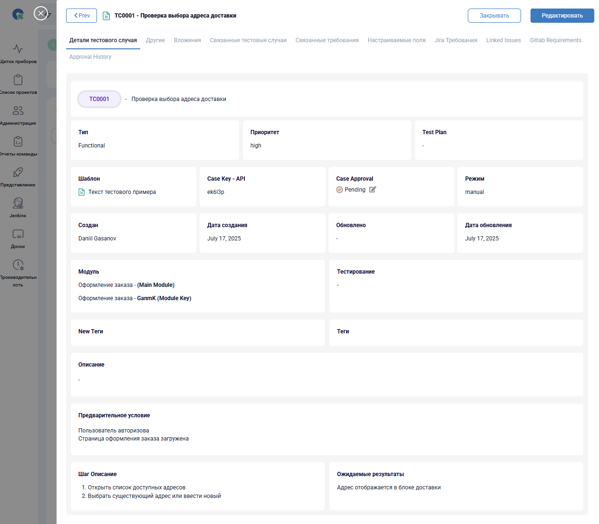
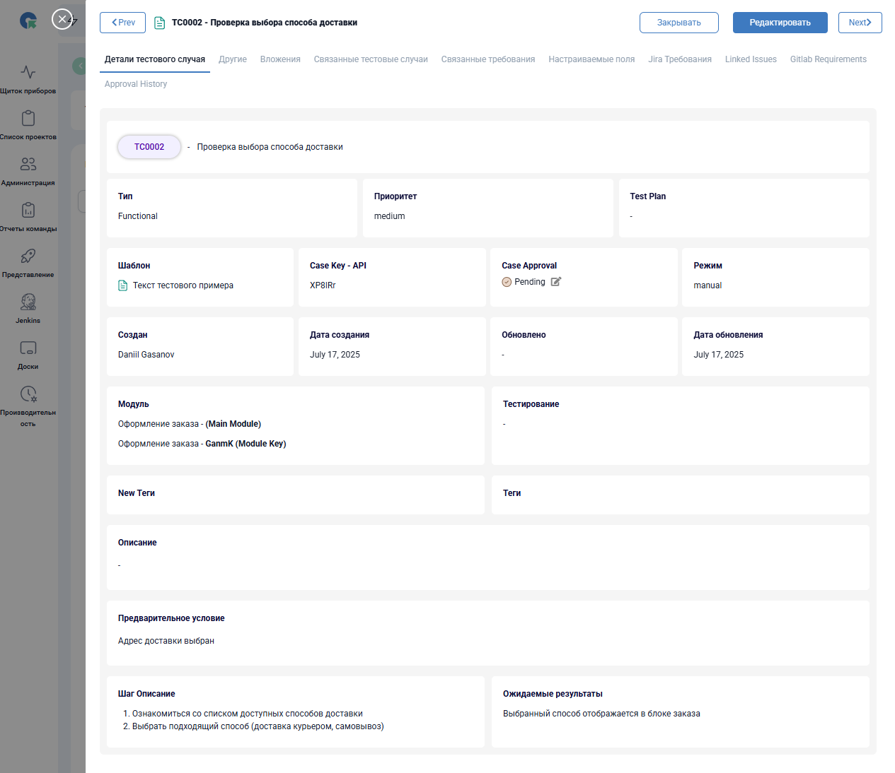
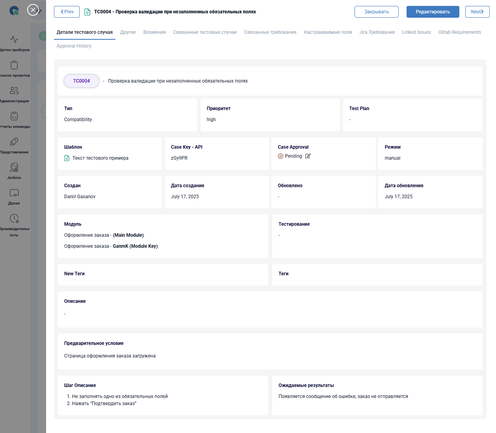
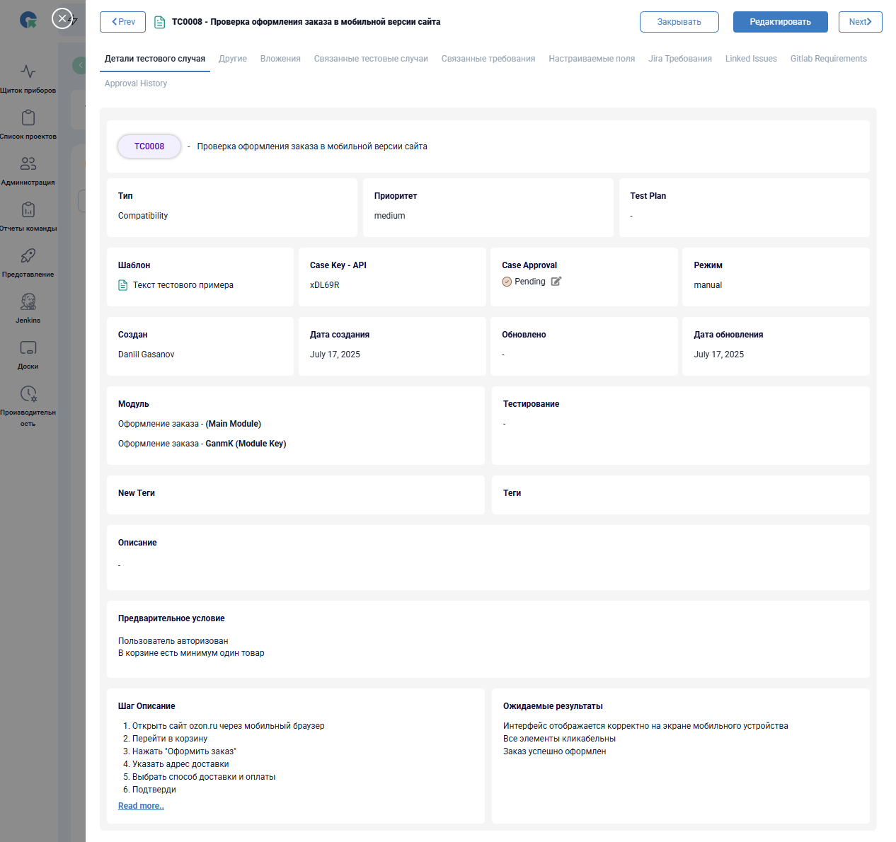
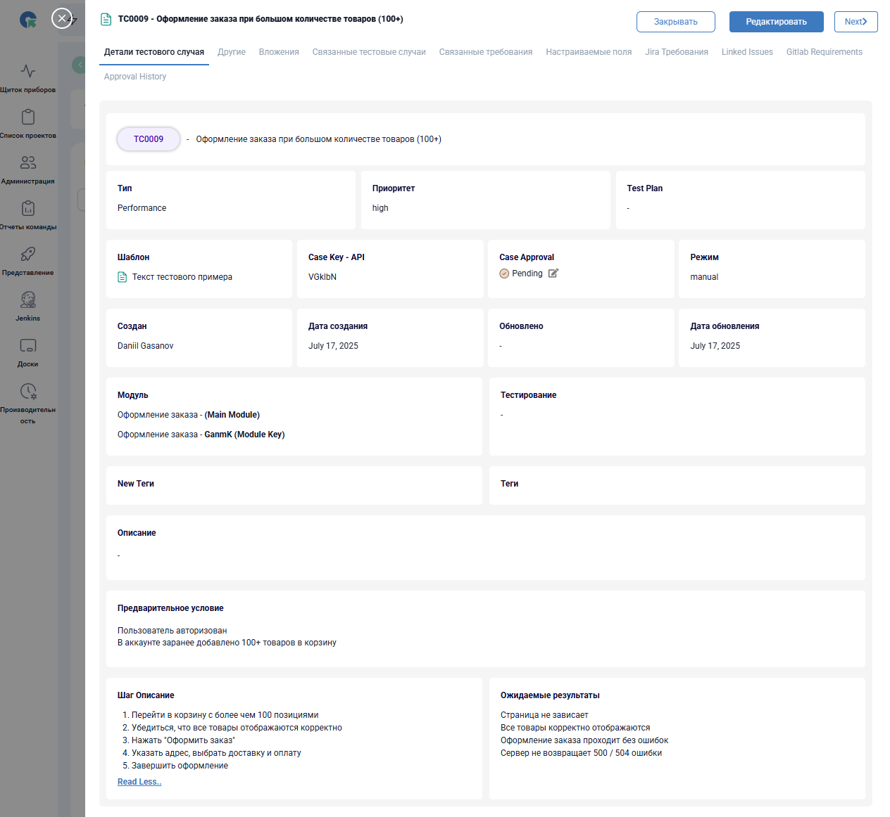

# Тест-кейсы: Оформление заказа Ozon.ru

Документация тест-кейсов оформлена в системе **QA Touch**.
Раздел оформления заказа сайта [ozon.ru](https://www.ozon.ru/cart)

---

### 🔹 Тест-кейс №1 — Проверка выбора адреса доставки

### 🔹 Тест-кейс №2 — Проверка выбора способа доставки

### 🔹 Тест-кейс №3 — Проверка выбора способа оплаты

### 🔹 Тест-кейс №4 — Проверка валидации при незаполненных обязательных полях

### 🔹 Тест-кейс №5 — Проверка сохранения заказа в истории заказов

### 🔹 Тест-кейс №6 — Проверка корректности применения промокода/списания баллов

### 🔹 Тест-кейс №7 — Проверка оформления заказа без входа в аккаунт

### 🔹 Тест-кейс №8 — Проверка оформления заказа в мобильной версии сайта

### 🔹 Тест-кейс №9 — Оформления заказа при большом количества товаров (100+)

## 💬 Комментарии

* Были протестированы типовые пользовательские сценарии, включая ошибки ввода, работу промокодов и поведение системы при незаполненных полях.
* Тест-кейсы охватывают как стандартные сценарии, так и кейсы по адаптивности и доступности.

## Другие разделы тестирования

- [Главная страница](https://github.com/daniilg17/testing-website/blob/main/MainPageTR.md) — тест-кейсы функционала главной страницы
- [Регистрация и авторизация](https://github.com/daniilg17/testing-website/blob/main/authTestIt.md) — проверка регистрации, входа и восстановления доступа
- [Корзина](https://github.com/daniilg17/testing-website/blob/main/basketQase.md) — тест-кейсы функционала корзины
- [Личный кабинет](https://github.com/daniilg17/testing-website/blob/main/profileTestiny.md) — тесты работы с аккаунтом пользователя и настройками
- [Список багов](https://github.com/daniilg17/testing-website/blob/main/bugs.md) — баг-репорты, оформленные в Jira, YouTrack и Redmine  

---

🔙 [Вернуться назад к описанию проекта](https://github.com/daniilg17/testing-website/blob/main/README.md)