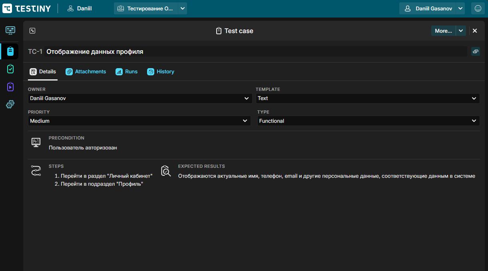
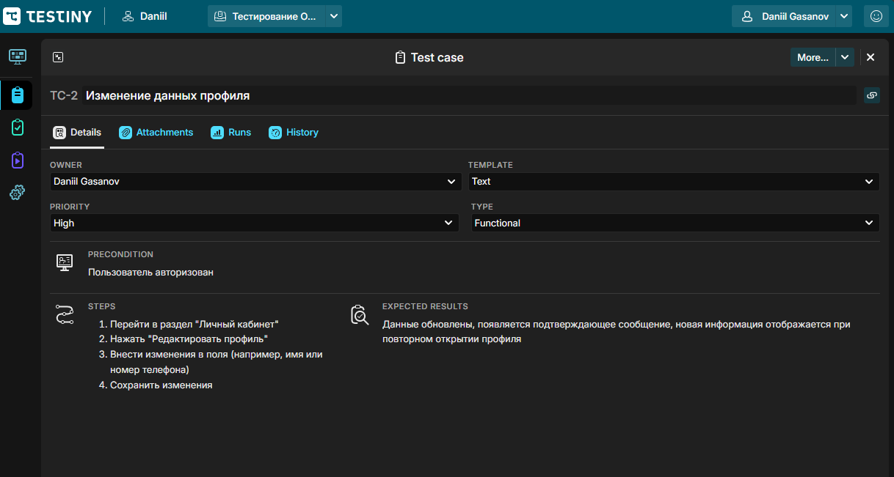
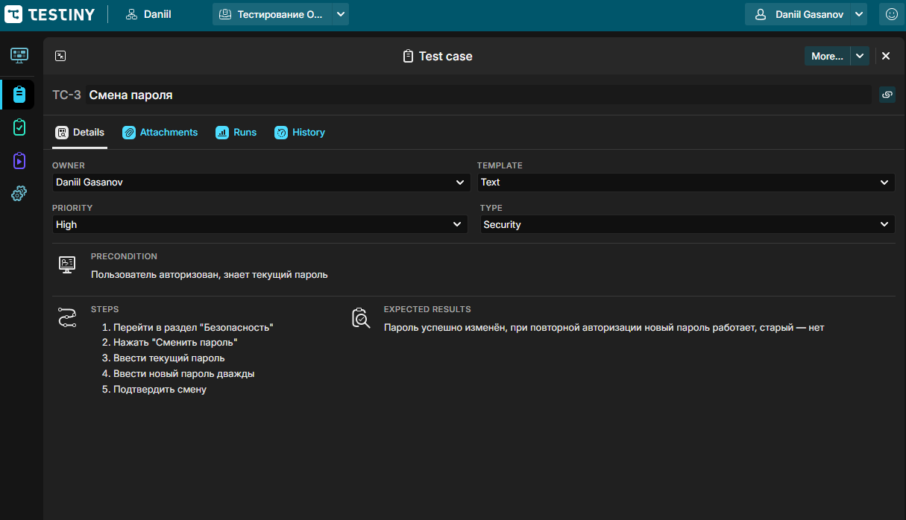
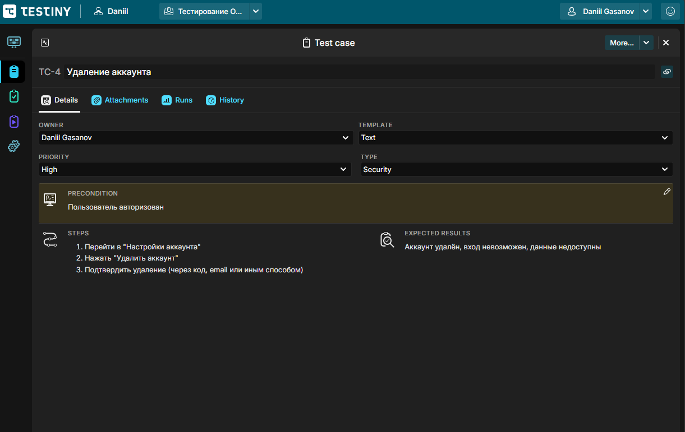
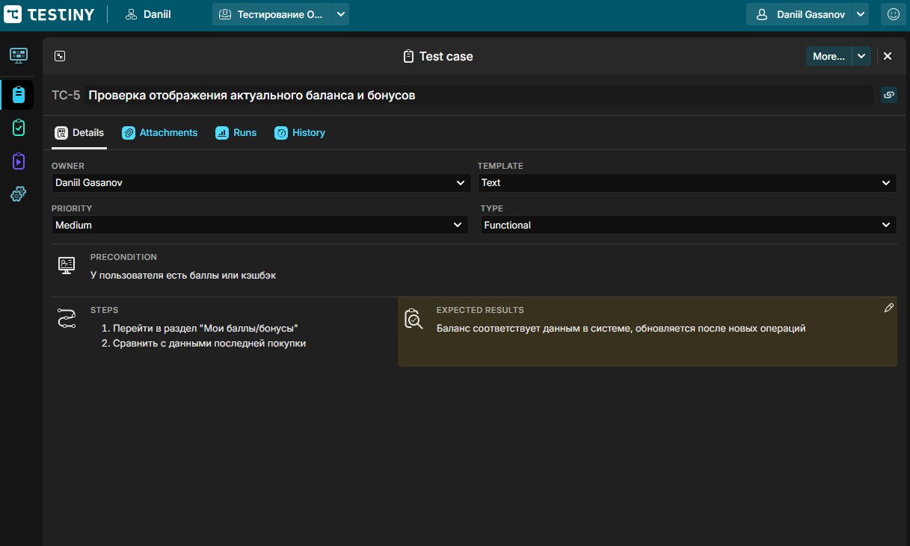
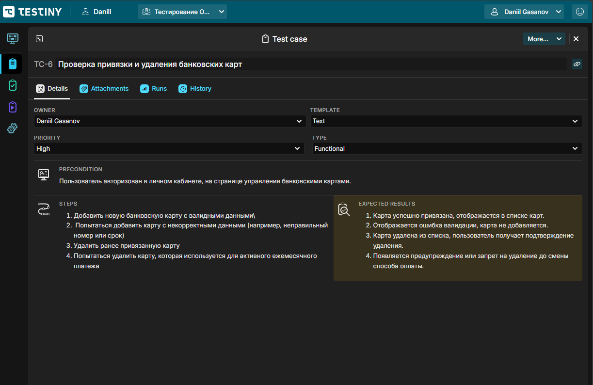
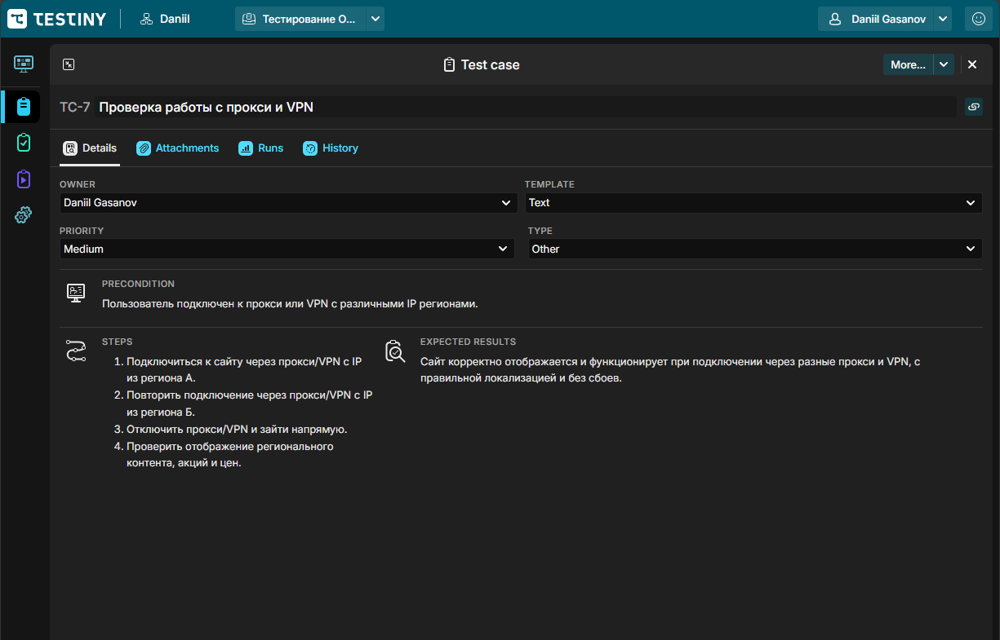

# Тест-кейсы: Личный кабинет Ozon.ru

Документация тест-кейсов оформлена в системе **Testiny**.   
Раздел личного кабинета сайта [ozon.ru](https://www.ozon.ru/profile)

---

### 🔹 Тест-кейс №1 — Отображение данных профиля

### 🔹 Тест-кейс №2 — Изменение данных профиля

### 🔹 Тест-кейс №3 — Смена пароля

### 🔹 Тест-кейс №4 — Удаление аккаунта

### 🔹 Тест-кейс №5 — Проверка отображения актуального баланса и бонусов

### 🔹 Тест-кейс №6 — Проверка привязки и удаления банковских карт

### 🔹 Тест-кейс №7 — Проверка работы с проки и VPN

## 💬 Комментарии

* Тестирование охватывает основные функции личного кабинета, включая безопасность, удобство работы и корректность отображения данных.
* Использовались инструменты DevTools для проверки адаптивности и анализа запросов.

## Другие разделы тестирования

- [Главная страница](https://github.com/daniilg17/testing-website/blob/main/MainPageTR.md) — тест-кейсы функционала главной страницы
- [Регистрация и авторизация](https://github.com/daniilg17/testing-website/blob/main/authTestIt.md) — проверка регистрации, входа и восстановления доступа
- [Корзина](https://github.com/daniilg17/testing-website/blob/main/basketQase.md) — тест-кейсы функционала корзины
- [Оформление заказа](https://github.com/daniilg17/testing-website/blob/main/orderQatouch.md) — тестирование оформления покупки и выбора способов доставки/оплаты
- [Список багов](https://github.com/daniilg17/testing-website/blob/main/bugs.md) — баг-репорты, оформленные в Jira, YouTrack и Redmine  

---

🔙 [Вернуться назад к описанию проекта](https://github.com/daniilg17/testing-website/blob/main/README.md)